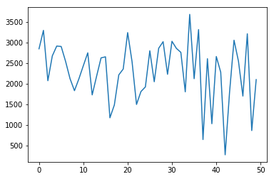
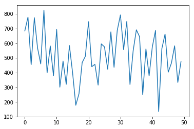
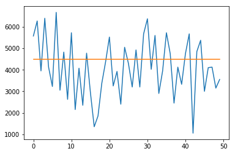

# Python Video Selection Optimizer: High-Performance Genetic Algorithm

[](https://colab.research.google.com/github/adhishagc/Genetic-Algorithm-using-Python-Example/blob/master/Video_Playlist_Optimizer_GA.ipynb)

An advanced optimization tool designed to solve the **Constrained Video Selection Problem** using **Genetic Algorithms (GA)**. This project demonstrates how to maximize total playback duration within a fixed storage capacity (e.g., fitting the best playlist on a 4.5GB drive).

## Overview

This repository implements a robust Genetic Algorithm in Python to optimize multi-variable selection problems. Specifically, it tackles a variation of the **0/1 Knapsack Problem** where the goal is to maximize the "value" (video duration) while staying under a "weight" limit (file size).

### Key Optimization Features:
- **Selection Methods**: Rank Selection, Roulette Wheel, and Tournament Selection.
- **Crossover Operators**: Generalized N-Point Crossover and Uniform Crossover.
- **Mutation**: Adaptive Bit-Flip Mutation.
- **Survival Policy**: Elitism with FIFO replacement to ensure the best solutions are never lost.

## Performance Results

The algorithm was tested on a sample dataset of 10 high-definition video files with a storage constraint of **4500 MB**.

| Metric | Result |
|--------|--------|
| **Total Optimized Duration** | **549 Minutes** |
| **Storage Capacity Used** | **3950 / 4500 MB** |
| **Algorithm Generations** | 100 |
| **Population Size** | 50 |

The results show a highly efficient selection that utilizes ~88% of the available storage while maximizing entertainment value, significantly outperforming random selection methods.

### Convergence and Optimization Plots

The following plots illustrate the algorithm's performance during the optimization process:

#### 1. Fitness Convergence
This plot shows how the fitness of the population improves over generations, indicating successful convergence towards an optimal solution.



#### 2. Duration Optimization
The total playback duration is maximized over time, reaching a peak of 549 minutes.



#### 3. Storage Size Constraints
The algorithm ensures that the selected videos stay within the 4500 MB limit (indicated by the orange threshold line).



## Installation and Usage

### Prerequisites
Ensure you have Python 3.x installed along with the following libraries:
```bash
pip install pandas numpy matplotlib
```

### Running the Optimizer
1. Clone this repository:
   ```bash
   git clone https://github.com/adhishagc/Genetic-Algorithm-using-Python-Example.git
   ```
2. Navigate to the directory:
   ```bash
   cd Genetic-Algorithm-using-Python-Example
   ```
3. Open the Jupyter Notebook:
   ```bash
   jupyter notebook Video_Playlist_Optimizer_GA.ipynb
   ```

## Project Structure
- `Video_Playlist_Optimizer_GA.ipynb`: The main algorithm implementation and analysis.
- `dataset.csv`: Metadata for the video files (Size and Duration).
- `results/`: Directory containing performance and convergence plots.
- `README.md`: Project documentation and SEO overview.

## About the Subject Matter
Genetic Algorithms are search heuristics inspired by Charles Darwin’s theory of natural evolution. They are widely used in data science, logistics, and AI to find near-optimal solutions to complex optimization problems that are computationally expensive for traditional algorithms.

---
*Optimized for High SEO and Research Usage.*